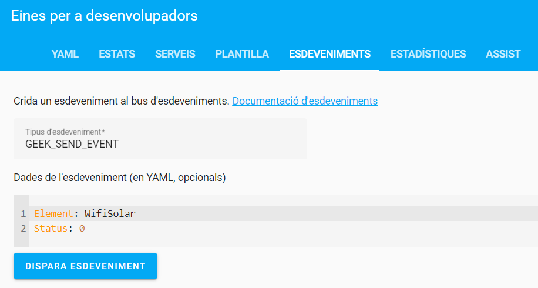
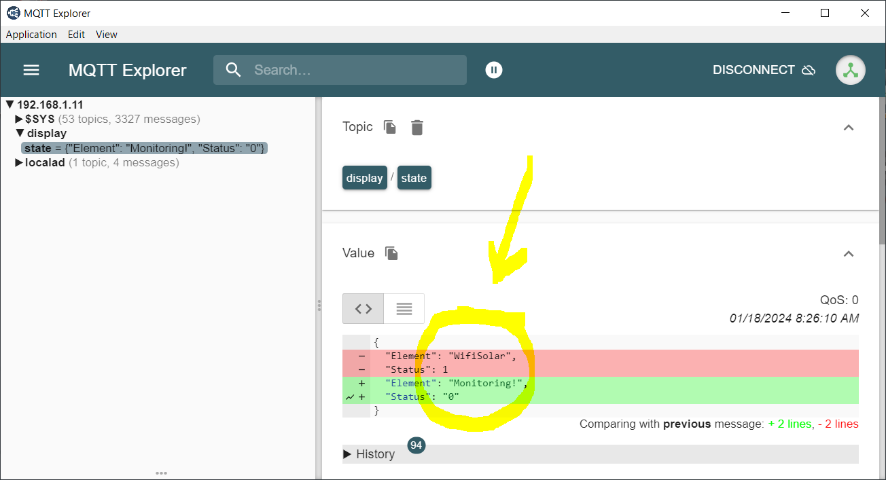

# HA-Mqtt-AppDaemon-Publisher
Contains the python scripts I use to interact with a Mqtt server from my HAServer using AppDaemon. It is so powerful beacuse you can invoque a service thru HAServer and this service is going to publish what you want in the Mqtt brocker.

## appdaemon.yaml

This is my file that configures my AppDaemon AddOn. It's important to activate both plugins HASS and MQTT, and in case of the MQTT adjust some local parameters:

> client_user: mqtt

The username used to connect to the Mqtt broker. It can be any of the users that have access to the HA Server (it can be a good idea to use the same one you configured while setting up the Mosquito Mqtt broker in HAServer).

> client_password: mqtt

The password for the username

## apps.yaml

So easy! Trust me! I'm an engineer! 

> geeksend:

The name of the project inside AppDaemon

>  module: geeksend

The name of the file without the .py extension

>  class: GeekSendClass

The name of the class you have defined inside the geeksend.py file

## geeksend.py

Get info from the event GEEK_SEND_EVENT called from HAServer and publish it in the Mqtt server. This is the json type we send:

```sh
MessageDict = {
    'Element': 'WifiSolar',
    'Status': '0'
}
```

## Calling events from HAServer with parameters

Call the service from the HAServer with the parameters in the yaml format:



See it appearing in the Mqtt broker


